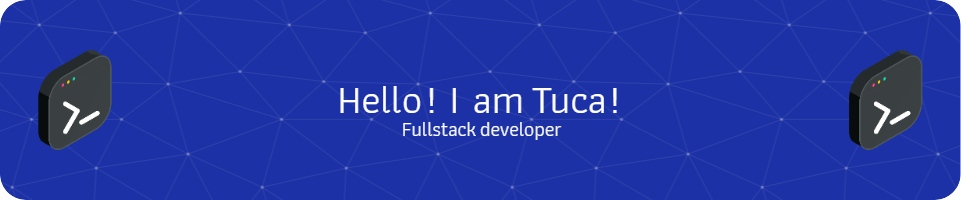

I am a Computer Engineering student (last semester) at UFGD. Interested in NLP/AI issues and learning new idioms.

* 🌍  I'm based in SP - Brazil
* 🖥️  See my extra portfolio at [LinkedIn](http://www.linkedin.com/in/tuca-dev/)
* ✉️  You can contact me at [tuca.dev@gmail.com](mailto:tuca.dev@gmail.com)
* 🚀  I'm currently working as an AI Analyst on DataAnnotation 
* 🧠  I'm delving into Python(data analysis), NLP and LLMs 
* 🗣️  I can speak Portuguese *(native)*, English *(C1 level)*, Spanish *(Intermediate)*, and Korean *(Basic)*

### Skills

### Badges

<b>Top Languages</b>

<b>Top Repositories</b>

       

### Socials

 <a href="https://www.github.com/Tuca-DEV" target="_blank" rel="noreferrer"> <picture> <source media="(prefers-color-scheme: dark)" srcset="https://raw.githubusercontent.com/danielcranney/readme-generator/main/public/icons/socials/github-dark.svg" /> <source media="(prefers-color-scheme: light)" srcset="https://raw.githubusercontent.com/danielcranney/readme-generator/main/public/icons/socials/github.svg" />  </picture> </a> <a href="https://www.linkedin.com/in/tuca-dev" target="_blank" rel="noreferrer"> <picture> <source media="(prefers-color-scheme: dark)" srcset="https://raw.githubusercontent.com/danielcranney/readme-generator/main/public/icons/socials/linkedin-dark.svg" /> <source media="(prefers-color-scheme: light)" srcset="https://raw.githubusercontent.com/danielcranney/readme-generator/main/public/icons/socials/linkedin.svg" />  </picture> </a>

